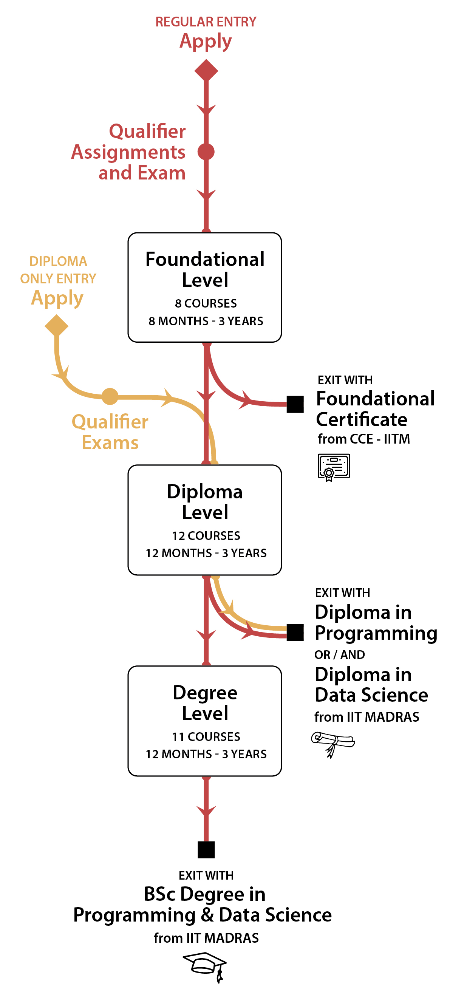

# Types of Admission

There are two types of admissions:
- Regular Entry
- Diploma-only Entry

# Regular Entry

Anyone opting for regular entry will start at the foundational level. The path that one has to follow in this is given below:

```bash
--Start
    |
    | (Qualifier Exam)
    ↓
--Foundational --> (Exit with foundational level certificate)
    |
    |
    ↓
--Diploma (Data Science OR Programming OR BOTH) --> Exit with Diploma(s)
    |
    |
    ↓
--B.Sc (Data Science and Programming)
    |
    |
    ↓
--Exit with B.Sc (Programming and Data Science)
```

# Diploma-only Entry

Anyone opting for diploma-only entry will start at the diploma level. They won't be eligible for the degree level.
The path that one has to follow in this is given below:

```bash
--Start
    |
    |
    ↓
--Diploma (Data Science OR Programming OR BOTH)
    |
    |
    ↓
--Exit with Diploma(s)
```

# Exam Path Infographic



###### Source: IITM Online B.Sc Website [LINK](https://onlinedegree.iitm.ac.in/academics.html)

For more information, visit the official website of IITM Online Degree by clicking [HERE](https://onlinedegree.iitm.ac.in/admissions.html)

**(DISCLAIMER: THIS WEBSITE IS NOT AFFILIATED WITH IITM ONLINE DEGREE. IT'S JUST A SITE FOR AGGREGATING ALL THE ANNOUNCEMENTS,
UPDATES ETC MADE BY IITM ABOUT IT'S ONLINE DEGREE. PLEASE VISIT THEIR OFFICIAL WEBSITE BY CLICKING [HERE](https://onlinedegree.iitm.ac.in/admissions.html))**